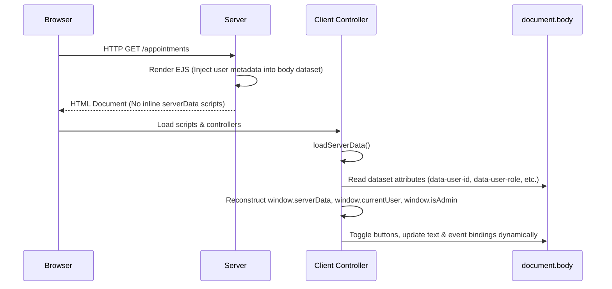

# Technical Design: Frontend Template Logic Cleanup

## Technical Approach
We will decouple EJS templates from dynamic javascript bootstrapping and inline role branching. This ensures templates remain presentational, eliminates duplicated script tags, and manages state cleanly.



---

## Architecture Decisions

### 1. Reconstruct `window.serverData` from Body Dataset
* **Choice**: Render server EJS values as `data-*` attributes on `<body>` and reconstruct `window.serverData` in `server-data-loader.js`.
* **Alternatives**:
  * Keep inline `<script>window.serverData = ...</script>` (Rejected: Pollutes template markup, violates presentational EJS standard, and increases script maintenance).
  * Load all data exclusively via client-side fetch (Rejected: Adds extra HTTP round-trips for basic user context).
* **Rationale**: Reconstruction preserves absolute backward compatibility with legacy scripts relying on `window.serverData` or `window.currentUser` while allowing zero inline script injection in EJS templates.

### 2. Client-Side Button Text and Event Binding
* **Choice**: Relocate role-based button labeling to `AppointmentUIManager.populateSelects` and event binding to `AppointmentFormManager`.
* **Alternatives**: Use server-side EJS branching for text rendering (Rejected: Keeps UI-branching logic coupled to EJS).
* **Rationale**: Tying event registration and text toggles to the controller lifecycle guarantees deterministic clean state, especially during DOM re-cloning or navigation.

---

## File Changes

| File | Action | Description |
|---|---|---|
| `frontend/src/views/partials/scripts.ejs` | Create | Shared partial containing the Bootstrap bundle JS loader. |
| `frontend/public/js/appointment/modules/server-data-loader.js` | Modify | Retrieve metadata from `<body>` dataset first. Fall back to existing API / session logic. |
| `frontend/public/js/appointment/modules/ui-manager.js` | Modify | Update `populateSelects` to read role data and set `#btn-add-new-appointment` text dynamically. |
| `frontend/public/js/appointment/modules/form-manager.js` | Modify | Register change listener on `#patientSelect` in both `bindAddFormEvents` and `bindEditFormEvents`. |
| `frontend/public/js/dashboard/dashboard-controller.js` | Modify | Import `server-data-loader.js` and call `loadServerData` in `init()` for global safety. |
| `frontend/src/views/dashboard/dashboard.ejs` | Modify | Move inline global state script to `<body>` dataset. Include new `scripts` partial. |
| `frontend/src/views/appointments/appointment*.ejs` | Modify | Move inline global state script to `<body>` dataset. Remove inline event scripts. Include new `scripts` partial. |
| All other views (e.g. `dentists/`, `patients/`) | Modify | Replace hardcoded Bootstrap `<script>` tag with the shared EJS partial. |

---

## Interfaces / Contracts

### 1. HTML Body Metadata Structure
All EJS templates will define metadata context on the `<body>` tag:
```html
<body
  data-user-id="<%= user.id %>"
  data-user-first-name="<%= user.firstName %>"
  data-user-last-name="<%= user.lastName %>"
  data-user-email="<%= user.email %>"
  data-user-role="<%= user.role %>"
  data-is-admin="<%= user.role === 'ADMIN' %>"
  <% if (typeof appointmentId !== 'undefined' && appointmentId) { %>data-appointment-id="<%= appointmentId %>"<% } %>
  data-current-page="<%= typeof currentPage !== 'undefined' ? currentPage : '' %>"
>
```

### 2. State Loader Reconstructor (`server-data-loader.js`)
```javascript
export async function loadServerData({ currentPage, getAppointmentId }) {
  try {
    if (document.body && document.body.dataset.userId) {
      const data = {
        user: {
          id: document.body.dataset.userId,
          firstName: document.body.dataset.userFirstName || '',
          lastName: document.body.dataset.userLastName || '',
          email: document.body.dataset.userEmail || '',
          role: document.body.dataset.userRole || ''
        },
        isAdmin: document.body.dataset.isAdmin === 'true',
        appointmentId: document.body.dataset.appointmentId || null,
        currentPage: document.body.dataset.currentPage || currentPage || ''
      };
      window.serverData = data;
      window.currentUser = data.user;
      window.isAdmin = data.isAdmin;
      return data;
    }
    // Existing fallbacks follow...
  } catch (error) { ... }
}
```

---

## Testing Strategy

| Target | Test Method | Expectation |
|---|---|---|
| EJS Templates | Static Check | No inline `<script>` tags setting `window.serverData` or `window.currentUser`. |
| Server Data Loader | Unit Test | Reconstructs `window.serverData` identical in structure and type to the original EJS payload. |
| UI Manager | Unit Test | Correct button label rendered: `"Programar Cita para Paciente"` (Admin) vs `"Solicitar Mi Cita"` (User). |
| Form Manager | E2E/Unit | Selecting patient updates patient read-only fields on both Add and Edit pages. |
| Regression | Existing Suites | Run `npm test` to verify `appointment-srp-split.test.js` passes. |

---

## Migration / Rollout
1. Deploy `scripts.ejs` and update templates to include it.
2. Update `server-data-loader.js` and add `<body>` data attributes to dashboard/appointment EJS templates.
3. Relocate button and dropdown event listener logic to controllers. Run unit tests.

---

## Open Questions
None.
